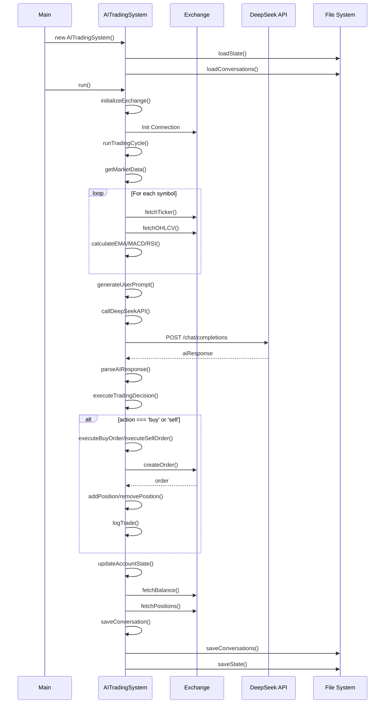
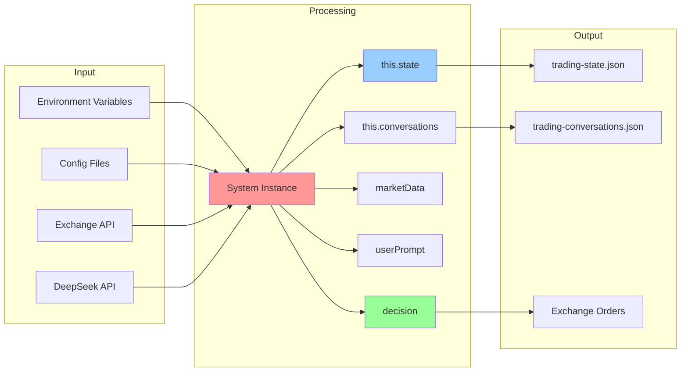
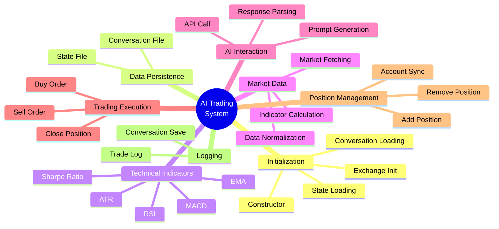

# AI Trading System - Function Module Diagram

## Function Module Diagram (Mermaid)

```mermaid
graph TB
    subgraph "Initialization & Configuration"
        A[constructor] --> A1[loadState]
        A --> A2[loadConversations]
        A --> A3[Set Mode/Whitelist]
        B[initializeExchange] --> B1[Init Exchange]
    end

    subgraph "Data Persistence"
        C1[loadState/saveState]
        C2[loadConversations/saveConversations]
        C1 -.->|read/write| FILE1[trading-state.json]
        C2 -.->|read/write| FILE2[trading-conversations.json]
    end

    subgraph "Technical Indicators"
        D1[calculateEMA]
        D2[calculateMACD] --> D1
        D3[calculateRSI]
        D4[calculateATR]
        D5[generateEMASeries] --> D1
        D6[generateMACDSeries] --> D2
        D7[generateRSISeries] --> D3
        D8[calculateSharpeRatio]
    end

    subgraph "Market Data"
        E[getMarketData] --> E1[exchange.fetchTicker]
        E --> E2[exchange.fetchOHLCV]
        E --> D2
        E --> D3
        E --> D4
        E --> E3[normalizeBaseSymbol]
        E --> D5
        E --> D6
        E --> D7
    end

    subgraph "Prompt Generation"
        F[generateUserPrompt] --> F1[Use state data]
        F --> F2[Use marketData]
        F --> D8
    end

    subgraph "AI Call"
        G[callDeepSeekAPI] --> G1[Build system_prompt]
        G --> G2[fetch DeepSeek API]
    end

    subgraph "AI Response Parsing"
        H[parseAIResponse] --> H1[Extract JSON]
        H --> H2[normalizeAction]
        H --> E3
        H --> H3[Priority Selection]
    end

    subgraph "Trading Execution"
        I[executeTradingDecision] --> I1{action type}
        I1 -->|buy| J[executeBuyOrder]
        I1 -->|sell| K[executeSellOrder]
        I1 -->|close_position| K
        I --> L[updateAccountState]
        J --> J1[normalizeBaseSymbol]
        J --> J2[exchange.createOrder]
        J --> M1[addPosition]
        J --> N[logTrade]
        K --> K1[normalizeBaseSymbol]
        K --> K2[exchange.createOrder]
        K --> M2[removePosition]
        K --> N
    end

    subgraph "Position Management"
        M1 --> E3
        M2 --> E3
        L --> L1[exchange.fetchBalance]
        L --> L2[exchange.fetchPositions]
    end

    subgraph "Logging & Records"
        N --> N1[saveState]
        O[saveConversation] --> O1[Parse aiParsed]
        O --> C2
    end

    subgraph "Main Flow"
        P[run] --> B
        P --> Q[showStatus]
        P --> R[runTradingCycle]
        R --> E
        R --> F
        R --> G
        R --> H
        R --> I
        R --> O
    end

    style A fill:#e1f5ff
    style B fill:#e1f5ff
    style R fill:#fff4e1
    style I fill:#ffe1f5
    style G fill:#e1ffe1
```

## Main Call Chain (Sequence Diagram)

```mermaid
sequenceDiagram
    participant Main
    participant System as AITradingSystem
    participant Exchange
    participant AI as DeepSeek API
    participant File as File System

    Main->>System: new AITradingSystem()
    System->>File: loadState()
    System->>File: loadConversations()
    
    Main->>System: run()
    System->>System: initializeExchange()
    System->>Exchange: Init Connection
    
    System->>System: runTradingCycle()
    
    System->>System: getMarketData()
    loop For each symbol
        System->>Exchange: fetchTicker()
        System->>Exchange: fetchOHLCV()
        System->>System: calculateEMA/MACD/RSI()
    end
    
    System->>System: generateUserPrompt()
    System->>System: callDeepSeekAPI()
    System->>AI: POST /chat/completions
    AI-->>System: aiResponse
    
    System->>System: parseAIResponse()
    System->>System: executeTradingDecision()
    
    alt action === 'buy' or 'sell'
        System->>System: executeBuyOrder/executeSellOrder()
        System->>Exchange: createOrder()
        Exchange-->>System: order
        System->>System: addPosition/removePosition()
        System->>System: logTrade()
    end
    
    System->>System: updateAccountState()
    System->>Exchange: fetchBalance()
    System->>Exchange: fetchPositions()
    
    System->>System: saveConversation()
    System->>File: saveConversations()
    System->>File: saveState()
```

## Data Flow Diagram

```mermaid
flowchart LR
    subgraph "Input"
        ENV[Environment Variables]
        CONFIG[Config Files]
        EXCHANGE_API[Exchange API]
        AI_API[DeepSeek API]
    end

    subgraph "Processing"
        SYSTEM[System Instance]
        STATE[this.state]
        CONV[this.conversations]
        MARKET[marketData]
        PROMPT[userPrompt]
        DECISION[decision]
    end

    subgraph "Output"
        STATE_FILE[trading-state.json]
        CONV_FILE[trading-conversations.json]
        ORDERS[Exchange Orders]
    end

    ENV --> SYSTEM
    CONFIG --> SYSTEM
    EXCHANGE_API --> SYSTEM
    AI_API --> SYSTEM
    
    SYSTEM --> STATE
    SYSTEM --> CONV
    SYSTEM --> MARKET
    SYSTEM --> PROMPT
    SYSTEM --> DECISION
    
    STATE --> STATE_FILE
    CONV --> CONV_FILE
    DECISION --> ORDERS
    
    style SYSTEM fill:#ff9999
    style STATE fill:#99ccff
    style DECISION fill:#99ff99
```

## Function Module Checklist

```mermaid
mindmap
  root((AI Trading<br/>System))
    Initialization
      Constructor
      State Loading
      Conversation Loading
      Exchange Init
    Data Persistence
      State File
      Conversation File
    Technical Indicators
      EMA
      MACD
      RSI
      ATR
      Sharpe Ratio
    Market Data
      Market Fetching
      Indicator Calculation
      Data Normalization
    AI Interaction
      Prompt Generation
      API Call
      Response Parsing
    Trading Execution
      Buy Order
      Sell Order
      Close Position
    Position Management
      Add Position
      Remove Position
      Account Sync
    Logging
      Trade Log
      Conversation Save
```
