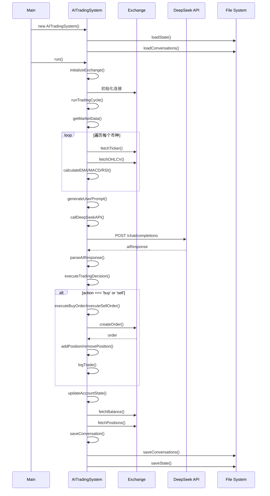
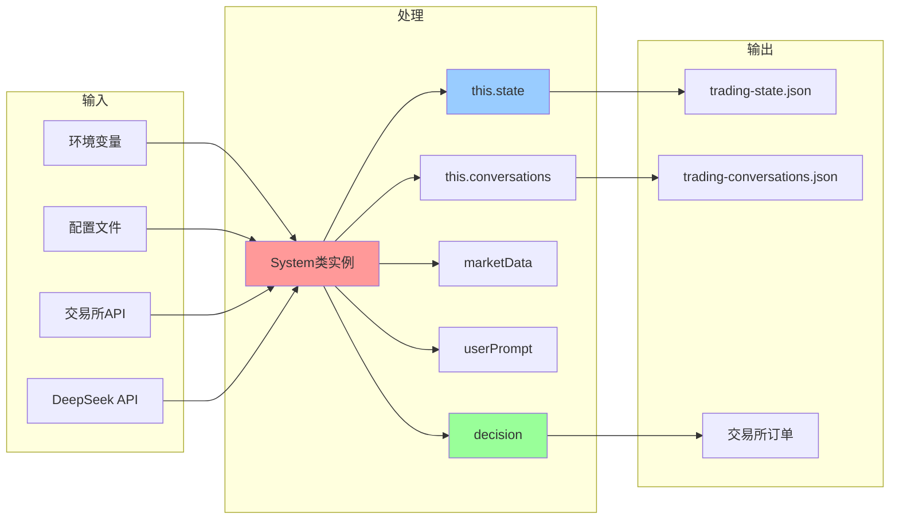
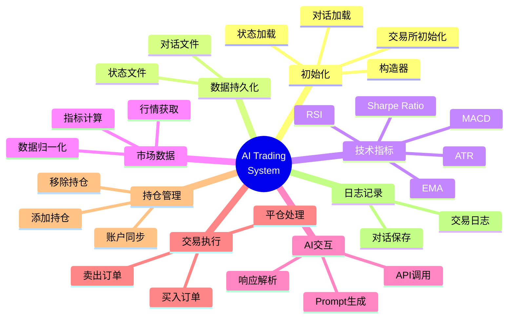

# AI Trading System - 功能模块图

## 功能模块图（Mermaid）

```mermaid
graph TB
    subgraph "初始化与配置"
        A[constructor] --> A1[loadState]
        A --> A2[loadConversations]
        A --> A3[设置模式/白名单]
        B[initializeExchange] --> B1[初始化交易所]
    end

    subgraph "数据持久化"
        C1[loadState/saveState]
        C2[loadConversations/saveConversations]
        C1 -.->|读写| FILE1[trading-state.json]
        C2 -.->|读写| FILE2[trading-conversations.json]
    end

    subgraph "技术指标计算"
        D1[calculateEMA]
        D2[calculateMACD] --> D1
        D3[calculateRSI]
        D4[calculateATR]
        D5[generateEMASeries] --> D1
        D6[generateMACDSeries] --> D2
        D7[generateRSISeries] --> D3
        D8[calculateSharpeRatio]
    end

    subgraph "市场数据获取"
        E[getMarketData] --> E1[exchange.fetchTicker]
        E --> E2[exchange.fetchOHLCV]
        E --> D2
        E --> D3
        E --> D4
        E --> E3[normalizeBaseSymbol]
        E --> D5
        E --> D6
        E --> D7
    end

    subgraph "Prompt生成"
        F[generateUserPrompt] --> F1[使用state数据]
        F --> F2[使用marketData]
        F --> D8
    end

    subgraph "AI调用"
        G[callDeepSeekAPI] --> G1[构建system_prompt]
        G --> G2[fetch DeepSeek API]
    end

    subgraph "AI响应解析"
        H[parseAIResponse] --> H1[提取JSON]
        H --> H2[normalizeAction]
        H --> E3
        H --> H3[优先级选择]
    end

    subgraph "交易执行"
        I[executeTradingDecision] --> I1{action类型}
        I1 -->|buy| J[executeBuyOrder]
        I1 -->|sell| K[executeSellOrder]
        I1 -->|close_position| K
        I --> L[updateAccountState]
        J --> J1[normalizeBaseSymbol]
        J --> J2[exchange.createOrder]
        J --> M1[addPosition]
        J --> N[logTrade]
        K --> K1[normalizeBaseSymbol]
        K --> K2[exchange.createOrder]
        K --> M2[removePosition]
        K --> N
    end

    subgraph "持仓管理"
        M1 --> E3
        M2 --> E3
        L --> L1[exchange.fetchBalance]
        L --> L2[exchange.fetchPositions]
    end

    subgraph "日志与记录"
        N --> N1[saveState]
        O[saveConversation] --> O1[解析aiParsed]
        O --> C2
    end

    subgraph "主流程"
        P[run] --> B
        P --> Q[showStatus]
        P --> R[runTradingCycle]
        R --> E
        R --> F
        R --> G
        R --> H
        R --> I
        R --> O
    end

    style A fill:#e1f5ff
    style B fill:#e1f5ff
    style R fill:#fff4e1
    style I fill:#ffe1f5
    style G fill:#e1ffe1
```

## 主调用链路（序列图）

```mermaid
sequenceDiagram
    participant Main
    participant System as AITradingSystem
    participant Exchange
    participant AI as DeepSeek API
    participant File as File System

    Main->>System: new AITradingSystem()
    System->>File: loadState()
    System->>File: loadConversations()
    
    Main->>System: run()
    System->>System: initializeExchange()
    System->>Exchange: 初始化连接
    
    System->>System: runTradingCycle()
    
    System->>System: getMarketData()
    loop 遍历每个币种
        System->>Exchange: fetchTicker()
        System->>Exchange: fetchOHLCV()
        System->>System: calculateEMA/MACD/RSI()
    end
    
    System->>System: generateUserPrompt()
    System->>System: callDeepSeekAPI()
    System->>AI: POST /chat/completions
    AI-->>System: aiResponse
    
    System->>System: parseAIResponse()
    System->>System: executeTradingDecision()
    
    alt action === 'buy' or 'sell'
        System->>System: executeBuyOrder/executeSellOrder()
        System->>Exchange: createOrder()
        Exchange-->>System: order
        System->>System: addPosition/removePosition()
        System->>System: logTrade()
    end
    
    System->>System: updateAccountState()
    System->>Exchange: fetchBalance()
    System->>Exchange: fetchPositions()
    
    System->>System: saveConversation()
    System->>File: saveConversations()
    System->>File: saveState()
```

## 数据流向图

```mermaid
flowchart LR
    subgraph "输入"
        ENV[环境变量]
        CONFIG[配置文件]
        EXCHANGE_API[交易所API]
        AI_API[DeepSeek API]
    end

    subgraph "处理"
        SYSTEM[System类实例]
        STATE[this.state]
        CONV[this.conversations]
        MARKET[marketData]
        PROMPT[userPrompt]
        DECISION[decision]
    end

    subgraph "输出"
        STATE_FILE[trading-state.json]
        CONV_FILE[trading-conversations.json]
        ORDERS[交易所订单]
    end

    ENV --> SYSTEM
    CONFIG --> SYSTEM
    EXCHANGE_API --> SYSTEM
    AI_API --> SYSTEM
    
    SYSTEM --> STATE
    SYSTEM --> CONV
    SYSTEM --> MARKET
    SYSTEM --> PROMPT
    SYSTEM --> DECISION
    
    STATE --> STATE_FILE
    CONV --> CONV_FILE
    DECISION --> ORDERS
    
    style SYSTEM fill:#ff9999
    style STATE fill:#99ccff
    style DECISION fill:#99ff99
```

## 功能模块清单

```mermaid
mindmap
  root((AI Trading<br/>System))
    初始化
      构造器
      状态加载
      对话加载
      交易所初始化
    数据持久化
      状态文件
      对话文件
    技术指标
      EMA
      MACD
      RSI
      ATR
      Sharpe Ratio
    市场数据
      行情获取
      指标计算
      数据归一化
    AI交互
      Prompt生成
      API调用
      响应解析
    交易执行
      买入订单
      卖出订单
      平仓处理
    持仓管理
      添加持仓
      移除持仓
      账户同步
    日志记录
      交易日志
      对话保存
```
