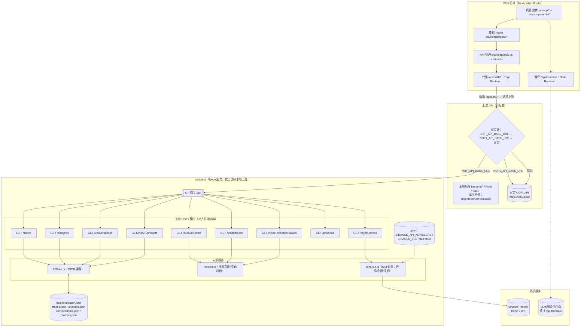
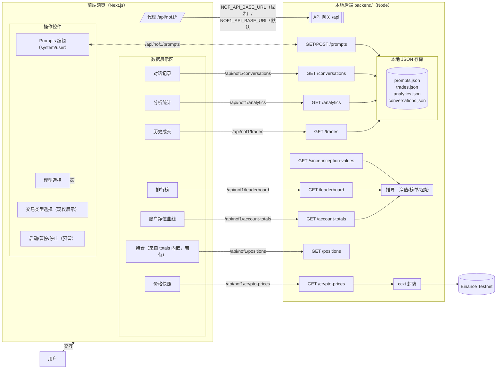
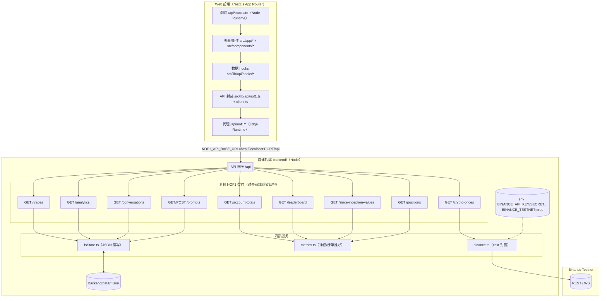

## 系统功能与数据流向图（最新）

### 说明
- 前端组件与 hooks 仍消费 `/api/nof1/*`；代理根据环境变量把流量导向本地 backend 或官方上游。
- 选择本地后端时：行情通过 ccxt 访问 Binance Testnet；`trades/analytics/conversations/prompts` 读写本地 JSON；`account-totals/leaderboard/since-inception-values` 由 `metrics.ts` 推导生成。
- `NOF_API_BASE_URL` 优先于 `NOF1_API_BASE_URL`；未设置时默认直连官方。

---

## 功能逻辑图（当前项目，贴近 framework.png）

说明：
- 当前实现中，真实交易执行与账户订单同步未开启；交互侧以 prompts 保存、本地 JSON 数据与 ccxt 行情为主。
- 后端通过 `trades.json` 推导 `account-totals/leaderboard/since-inception-values`，用于驱动前端曲线与榜单。

